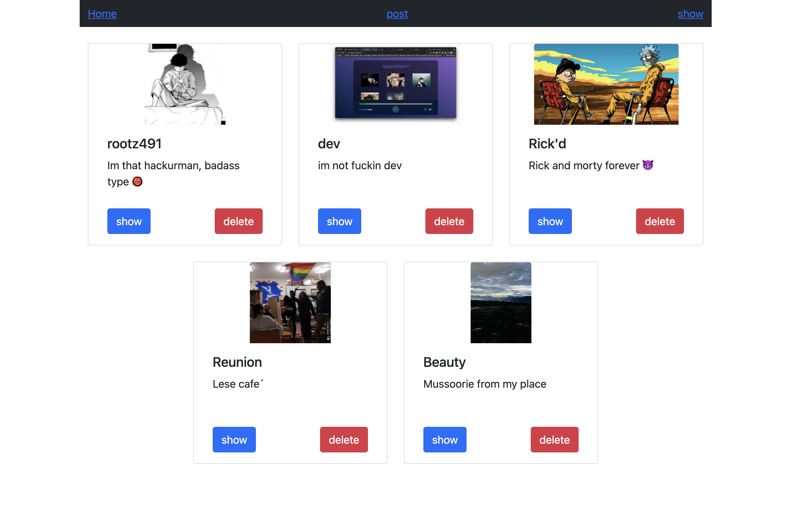
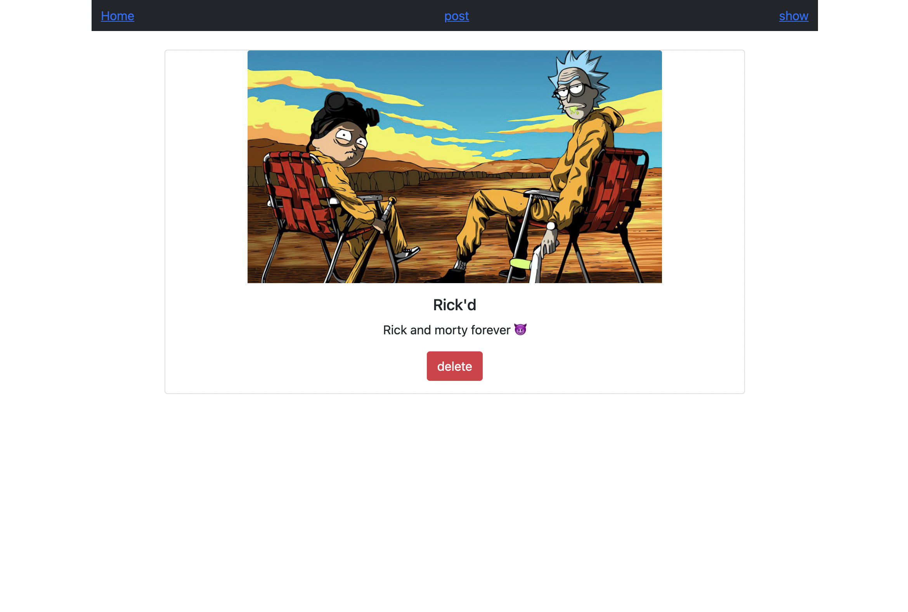
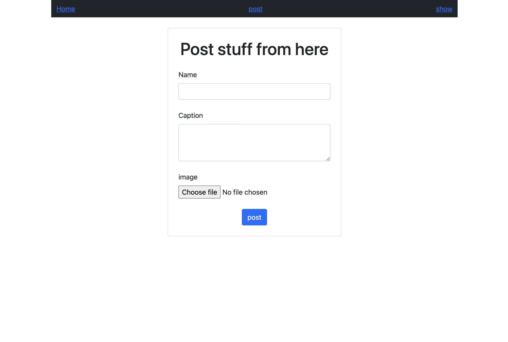
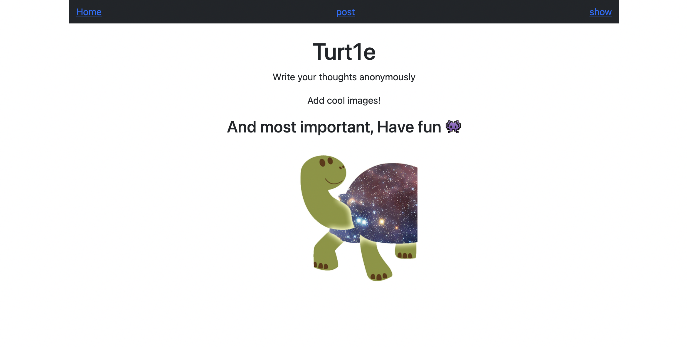

# turt1e

i dont know why i named it `this.name` but it's cool 😂

*  so this is a `react` webapp backed by `express.js`;
*  anyone can make a post;
    *   post consist of 3 things:
        1. name
        2. caption
        3. image
*   anyone can also delete post.
*   { images } are stored in `Cloudinary`
*   { name, caption } are stored in `mongodb`

---

##  screenshots

### show all posts

>   /show

>   /show/:id

>   /post

>   /

